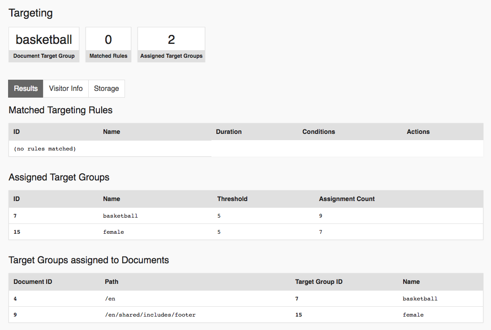
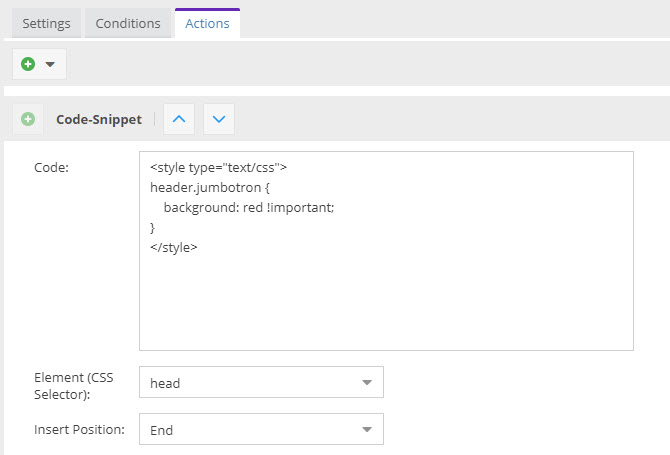
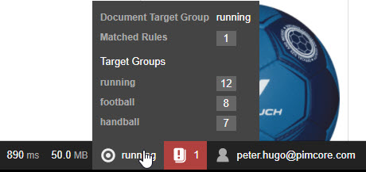
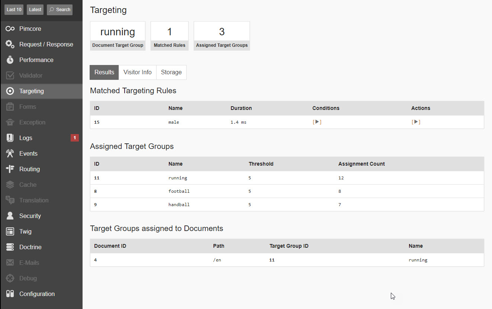

# Deliver Personalized Content

Once target groups are defined, visitor profiling rules are set and personalized content is created, it is time to 
deliver the personalized content to the right people. 

Pimcore provides two ways to deliver personalized Content: 

### Delivering Personalized Content with Documents

When a document is delivered to the visitor, the best matching variant is picked by Pimcore based on following rule:    

* If the visitor has only one assigned target group and content exists for that target group, the personalized variant 
  for that target group will be used
* If the visitor has multiple assigned target groups, they will be sorted by their assignment count. The first target 
  group in the sorted list which has personalized content for the document will be used.
      
This logic is repeated for every document and sub-request. This means you can show personalized content for a given target
group on a document, but have content for different target groups in snippets or renderlets rendered on the same page. 

You can see which target groups were applied to which document in the profiler. As you can see in the screenshot below,
the main document used the target group `basketball` while the footer snippet was rendered with the target group `female`.

 

For further debug information see below. 

### Delivering Personalized Content with Global Targeting Rules

In addition to Pimcore document delivery, global targeting rules provide two actions with further possibilities to 
deliver personalized content to the visitor.
 
1) **Redirect**: The visitor can be redirected when certain conditions match. E.g. redirect visitor on its first visit 
   to your site to a special landing page. 
  
2) **Code-Snippet**: The code snippet action allows to inject a code snippet to the response when certain conditions match.
   This opens up lots of possibilities such as restyling the page by injecting CSS, adding additional functionality by 
   adding JS Snippets or even injecting whole HTML code blocks.  
    

## Verify What Happens - aka Debug

The personalization configuration can become quite complex really quick. To get to know what happens, which rules matched
for a certain request, which target groups are assigned and what data is collected, Pimcore injects several information 
the Symfony profiler bar. 

On the detail page you can find all information about matching targeting rules, assigned target groups, chosen target 
groups for document delivery, all stored visitor information and content of the visitor storage. 

 

